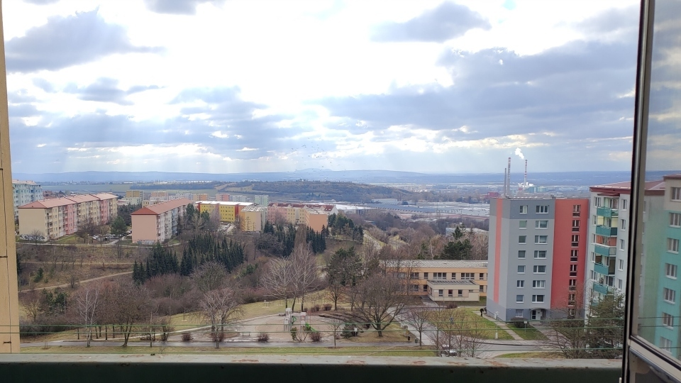
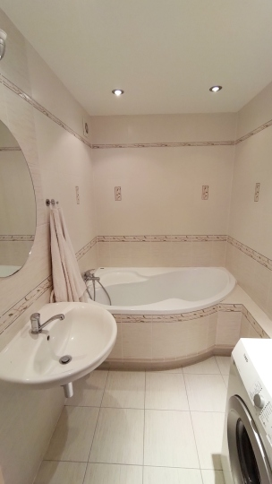
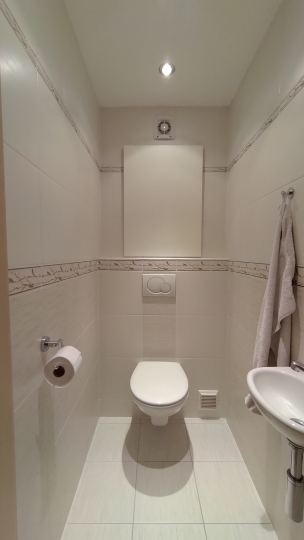

# Pronájem bytu 4+1 90 m²
## Elplova, Brno - Líšeň

Nabízím k pronájmu plně zařízený byt 4+1 v městské části Brno - Líšeň, ulice Elplova.

Bytová jednotka 90 m2 + 4 m2 balkon se nachází v 6. patře bytového domu s prostorným výtahem. Z bytu je nádherný výhled až na Pálavu a na líšeňskou Rokli.

Dispozice: vstupní chodba, 4 pokoje, kuchyně, koupelna, toaleta (zvlášť).
Byt disponuje balkonem přístupným z obývacího pokoje.
Všechny pokoje jsou neprůchozí, což poskytuje soukromí.
Byt je kompletně bezbariérový včetně výtahu a přístupové cesty.

Byt je moderně vybaven:
- kuchyně (rekonstrukce 2019) - prostorná kuchyňská linka, myčka, chladnička s mrazničkou, vestavná el. trouba, vestavná mikrovlnná trouba, indukční deska, odsavač par, sušička
- obývací pokoj – pohovka, obývací stěna, konferenční stůl
- koupelna: prostorná rohová vana, umyvadlo, pračka
- toaleta: samostatná místnost se záchodem, umyvadlo
- ložnice: 2x robustní kvalitní bukové postele se zvedacím roštem (možnost uskladnění přikrývek apod.), 2x robustní noční stolky, čtyřdílná vestavěná skříň
- 2 pokojíky: 1x robustní kvalitní javorová postel, 2x pracovní stůl s šuplíky, skříně PAX a další skříně a knihovničky z IKEA
- v chodbě se nacházejí 2 prostorné vestavěné skříně

Nájem činí 22.000,- Kč + služby, teplo, voda, elektřina (vaření, svícení) zhruba 6.500,-Kč. Elektřina bude přepsána na nového nájemníka. Pronájem bytu je vhodný například pro 3-4člennou rodinu, maximálně však pro 5 osob. Vratná kauce je ve výši 30.000 Kč. Nejsem RK, neplatíte žádnou provizi.

V bytě jsou velmi dobře izolující okna, dům je zateplen a zrevitalizován. Nebyl nicméně označen energetickým štítkem, proto je veden jako třída G (Mimořádně nehospodárná).

Byt je volný po domluvě ihned, preferuji nájemníky bez domácích zvířat.

Dům se nachází v lokalitě s veškerou občanskou vybaveností - v docházkové vzdálenosti se nacházejí supermarkety, zastávka tramvaje 8, autobusů 55 a 78, základní škola, mateřská škola, restaurace, aj. Cesta tramvají na hlavní nádraží 17 minut.

| <!-- -->                          | <!-- -->                                   |
|-----------------------------------|--------------------------------------------|
|__Celková cena:__                  | 22 000 Kč / měsíc                          |
|__Náklady na bydlení:__            | Zhruba 6500 Kč / měsíc                     |
|__Stavba:__                        | Panelová                                   |
|__Stav objektu:__                  | Zrekonstruovaný                            |
|__Podlaží:__                       | 6. patro                                   |
|__Užitná plocha:__                 | 90 m2                                      |
|__Balkon:__                        | 5 m2                                       |
|__Datum nastěhování:__             | Ihned                                      |
|__Voda:__                          | Dálkový vodovod                            |
|__Topení:__                        | Ústřední dálkové                           |
|__Plyn:__                          | Nevyužívá se                               |
|__Odpad:__                         | Veřejná kanalizace                         |
|__Doprava:__                       | Silnice, MHD (tramvaj 8, autobus 55 a 78)  |
|__Energetická náročnost budovy:__  | Třída G - Mimořádně nehospodárná           |
|__Vybavení:__                      | Plně zařízeno                              |
|__Výtah:__                         | Ano                                        |

## Další fotky

